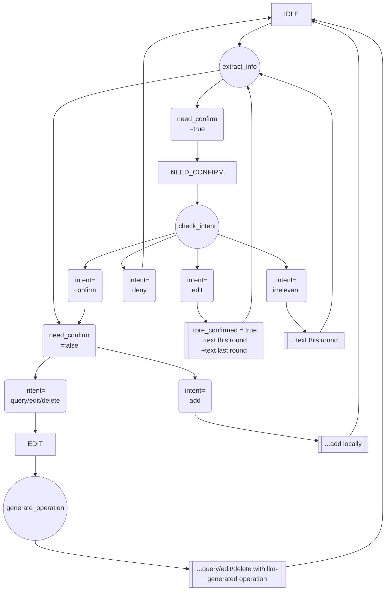

## 状态
- `IDLE`: 当前空闲，监听到的文本先提交给信息提取
- `NEED_CONFIRM`: 提取得到的信息可能包含日程，需要确认用户意图
- `EDIT`: 确认了用户希望删改查日程，将信息和当前全部日程交给llm确定具体操作

## 操作
- `extract_info`: 从监听文本中提取用户意图和信息
- `check_intent`: 确定用户意图
- `generate_operation`: 根据当前信息和日程表，生成具体查询，编辑或删除操作

## 转移


## `extract_info`
- `request.data`
    ```json
    {
        "text": "...", // 环境监听文本
        "pre_confirmed": true|false, // 已经确认过监听到的信息是日程，need_confirm应当为false
        "old_time": "...", // 上一轮对话提取的旧时间
        "old_description": "...", // 上一轮对话提取的旧描述
    }
    ```
- `response.data`
    ```json
    {
        "candidates": 
        [
            {
                "intent": "add|edit|delete|query",
                "need_confirm": true|false,
                "old_time": "...", // 提取得到的现有时间
                "old_description": "...", // 提取得到的现有描述
                "new_time": "...", // 提取得到的修改后的时间
                "new_description": "..." // 提取得到的修改后的描述
            },
        ]
    }
    ```
    - 对于用户明确给出指令的，`need_confirm`为`false`，否则为`true`。
    - 对于`add`意图，只有`new_time`和`new_description`。
    - 对于`delete`和`query`意图，只有`old_time`和`old_description`。
    - 对于`edit`意图，上述都有。

## `check_intent`
- `request.data`
    ```json
    {
        "question": "...", // 拼接过后的问题
        "text": "...", // 环境监听文本
    }
    ```
- `response.data`
    ```json
    {
        "intent": "confirm|deny|edit|irrelevant"
    }
    ```
    - `confirm`: 用户确认了监听到的信息是日程，直接基于旧信息修改
    - `deny`: 用户否认了监听到的信息是日程
    - `edit`: 用户确认了监听到的信息是日程，并希望进行修改，需要将新的文本和旧的信息一起（时间精度，描述精度）提交给`extract_info`
    - `irrelevant`: 监听到的信息与日程无关，将监听到的信息提交给`extract_info`

## `generate_operation`
- `request.data`
    ```json
    {
        "intent": "edit|delete|query",
        "old_time": "...", // 提取得到的现有时间
        "old_description": "...", // 提取得到的现有描述
        "new_time": "...", // 提取得到的修改后的时间
        "new_description": "...", // 提取得到的修改后的描述
        "all_schedules": 
        [
            {
                "id": ..., // id总是增加，不会回收已经使用过的id，避免同步问题
                "time": "...", // 日程时间
                "description": "..." // 日程描述
            },
        ]
    }
    ```
- `response.data`
    ```json
    {
        [
            {
                "operation": "edit|delete|query",
                "id": ...,
                "time": "...", // 修改后的时间，若为delete留空
                "description": "..." // 修改后的描述，若为delete留空
            },
        ]
    }
    ```

## 其他
- 提取得到的时间格式为YYYY-MM-DD HH:MM:SS